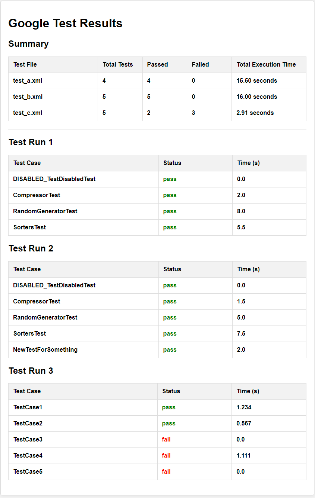

# gtest_Converter
Conversion tool that converts the GoogleTest XML into an HTML Reports. 
It will allow the ability to pass in a directory of test reports or a single file.

# Usage

    usage: googleTestXmlToHtmlConverter.py [-h] [--output OUTPUT] [--title TITLE]
                                           gtest_path
    
    Generate HTML report from GoogleTest XML files.
    
    positional arguments:
      gtest_path       Directory or file path to process
    
    options:
      -h, --help       show this help message and exit
      --output OUTPUT  HTML file path of the output HTML report file (default: Z:\__DEV\Projects\Python\gtest_Converter\gen_reports\gtest_results.html)
      --title TITLE    Title of the HTML report

# Example Google Test Result File

